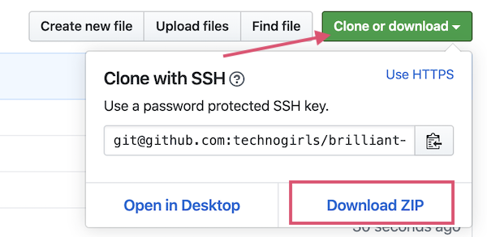
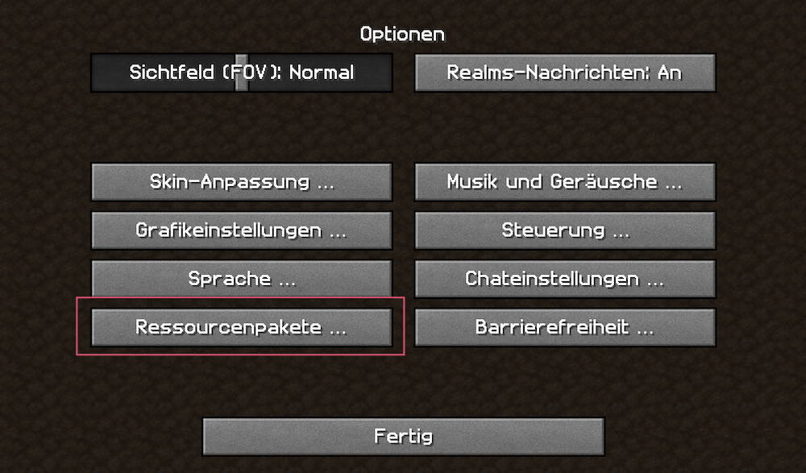
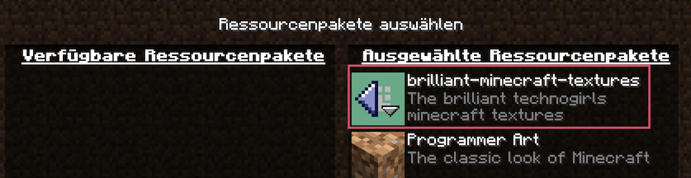
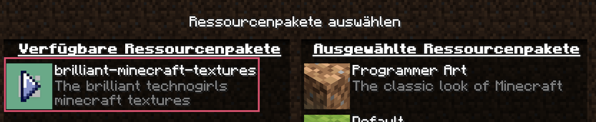
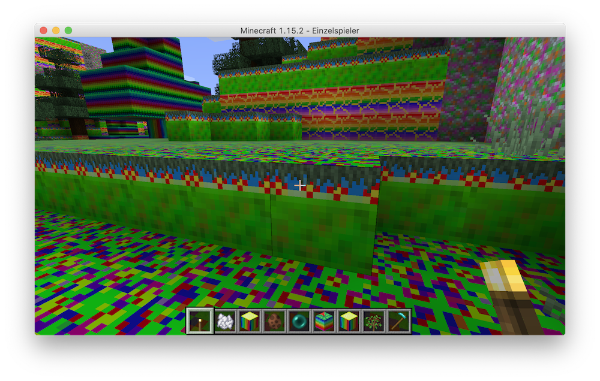

## Technogirls "Brilliant Minecraft Textures"

Farbenfrohe und lustige Texturen für Minecraft,

einfach über ["Zip-Download"](https://github.com/technogirls/brilliant-minecraft-textures/archive/master.zip) runterladen 

und in Minecraft - Resourcen Verzeichnis speichern.

Dann einfach nach rechts schieben.

Zum Aktualisieren einfach einmal nach links und dann wieder nach rechts schieben.

Wir haben geändert:

### Figuren

* Eisbär
* Creeper
* Zombie
* Kugelfisch
* Kaninchen
* Schildkröte
* Kuh 
* Steve
* Enderdrache
* Huhn
* Hexe
* Schwein
* Schwarze Katze
* Wolf
* Fuchs

### Blöcke

* Gras 
* Base
* Eis
* Erde
* Fliessendes Wasser
* Bücherregal
* Eiche
* Melone
* div. Blumen
* Diamant
* Lapis

und vieles mehr

Viel Spass beim Ausprobieren

Basiert auf "doubled default look" Textured.